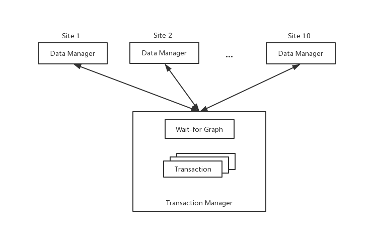

# RepCRec Distributed Database
Fall 2019 Advanced Database Course Project

## Authors
- Jialiang Cao(jc8343)
- Waii Ng(win205)

## Description
This is a Fall 2019 Advanced Database course project. For project requirements, please see `project-requirements` PDF.

## Architecture
The architecture of this RepCRec Distributed Database is as follow.

## Data
- 10 sites
- 20 data entries: x1, ..., x20
  - even indexed entires are in all sites
  - odd indexed entires are in site 1 + (index mod 10)

## Algorithms
- Available copies
- Multi-version read
- Deadlock detection

## Components
For component details, please see `RepCRec-design-doc` PDF.
  